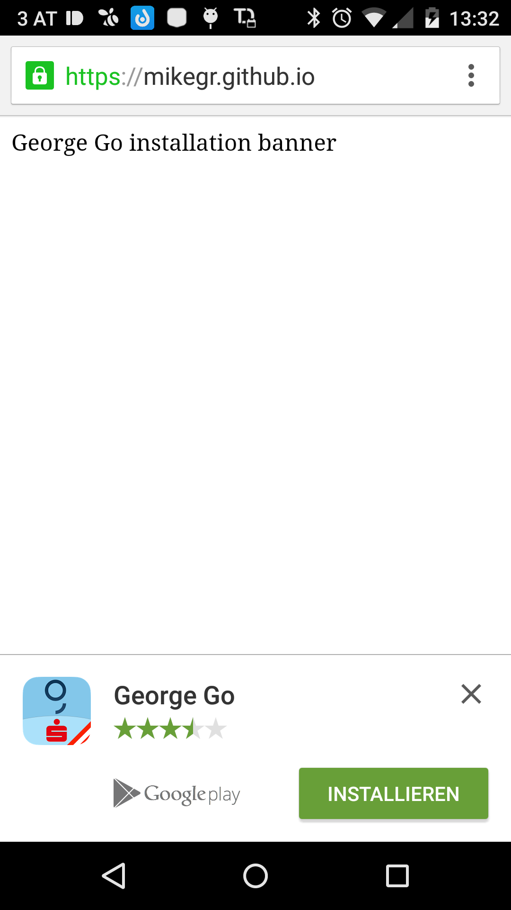

Native App install banners
==========================

Native App install banners are similar to Web app install banners, 
but instead of adding to the Homescreen will let the user inline install your native app.
Chrome will decide when to first prompt the user to install the app, 
currently when the user has visited your site twice over two separate days during the course of two weeks.

Documentation 
https://developers.google.com/web/updates/2015/03/increasing-engagement-with-app-install-banners-in-chrome-for-android#native

How to integrate for George Go

* Add in the head section a link to the manifest file <code><link rel="manifest" href="/manifest.json"></code>
* Add the manifest file from https://github.com/mikegr/nativeinstall/blob/gh-pages/manifest.json
* Add the four icons. 
https://github.com/mikegr/nativeinstall/blob/gh-pages/george_launcher[-2x|-3x|-4x].png

Requirements to test.

* Chrome 44+ (Latest version of Chrome from the Play Store is sufficient)
* "George Go" app MUST NOT be installed
* Activate flag in Chrome: chrome://flags/#bypass-app-banner-engagement-checks
* Access via HTTPS is important!

Go to 
https://mikegr.github.io/nativeinstall
for a working Georg Go example 

Another example from the Chrome developers
https://github.com/GoogleChrome/samples/blob/gh-pages/app-install-banner/related-applications/manifest.json

